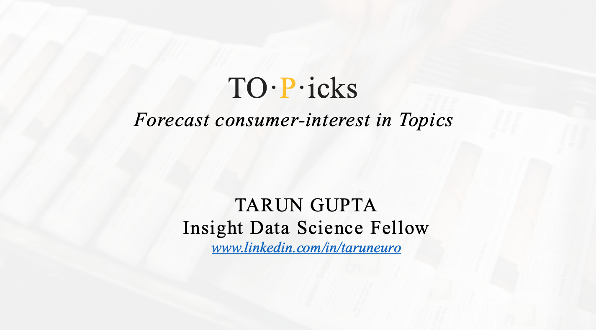

# TOPicks
__Forecast consumer-interest in Topics:__

TO·P·icks is a topic recommendation and consumer-engagement forecasting tool for content-makers, writers & marketing teams combining tf-idf/NMF topic modeling, feature engineering, & clustering with time-series prediction (ARIMA/Gradient Boosting) of user-engagement metrics.

__Author:__ Tarun Gupta
__Company:__ Insight Data Science
__Location:__ Toronto

