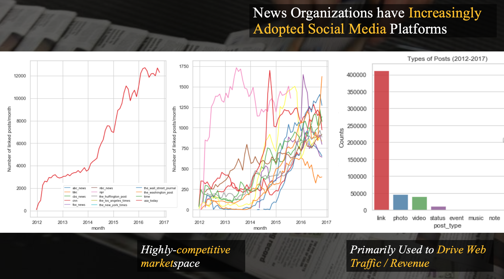

# TOPicks
__Forecast consumer-interest in Topics:__

TO·P·icks is a topic recommendation and consumer-engagement forecasting tool for content-makers, writers & marketing teams combining tf-idf/NMF topic modeling, feature engineering, & clustering with time-series prediction (ARIMA/Gradient Boosting) of user-engagement metrics.

__Author:__ Tarun Gupta. 
__Company:__ Insight Data Science.  
__Location:__ Toronto. 
__Web App:__ http://topicforecaster.com. 

 

There has been an interesting shift in how different news media organizations have  engaged with social media platforms over the last 5-6 years. My preliminary exploratory analysis of 15 major news media organizations like ABC, CNN, New York Times, Washington Post, Fox News, BBC etc. from 2012-2017 indicates a major strategic restructuring in these organizations with the goal of driving readership and advertisement revenue through social media platforms like Facebook. This is done primarily by posting web-links that redirect web-traffic from social media platforms, Facebook in this case, back to their source websites.

It's a highly competitive market and the content-makers are under constant pressure to create new content on topics people are interested in. However, there are very few empirical indicators of what sort of topics would actually drive reader attention in this crowded marketspace. If you go to Google search and type: "what should I write about" - you'll see hundreds of suggestions with catchy title like "10 hot topics you should write about". In fact, if you were to then go to Google Trend and check various versions of "topic to write about" or "what should I write about" etc., you'll see that content-makers from all over the world have been periodically searching for content ideas online. However, the popularity of these topics varies temporally and the static hard-coded suggestions in web articles or trial-and-error approaches are less than optimal. __TOPicks solves this problem by combining natural language processing and topic clustering with powerful machine learning algorithms for time-series forecasting, thereby driving predictive comparative insights regarding consumer-engagement and interest for candidate topics over the next few weeks.__

The machine learning model used to predict TOPicks analytics does significantly better than the baseline persistence model (that is, today is same as yesterday OR that tomorrow will be same as today). As some of you can appreciate - it can be hard to beat a persitence model in certain time-series datasets. After carefully comparing performance of various predictive models, from Ridge regression with L2 regularization optimization to hyperparameter tuning in ensemble algorithms, TOPick was able to significantly improve the predictions over the persistence model with Microsoft's lgbm implementation of gradient boosting. Further optimization with Bayesian hyperparameter optimization is currently underway along with the exploration of deep learning based approaches like the LSTM.

However, the real utility of TOPicks lies in one-step __comparative__ analytics on both historical trends as well as predictve forecasts for the topics under consideration. With a straightforward no-nonense interface, TOPicks is extremely user-friendly. As a content-creator, writer or decision-maker, you'd enter a list of 3 candidate topics you or your team is interested in potentially writing about and TOPicks will return historical popularity trends for your selected topics along with a __comparative weekly forecast__ for the next 8 weeks. It'll also return some additional topic suggestions related to your keywords that you might not have considered before.

